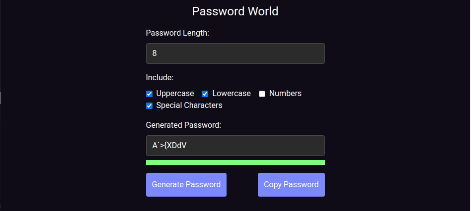

# Password World

This project has been published on Chrome Extension Store too! 
Download here : https://chrome.google.com/webstore/detail/random-password-generator/holmjanjldgdbfgphcjfloffhmemkglp?hl=en&authuser=2

Password World is a modern password generation tool that allows you to create strong and secure passwords with customizable length and character types. This web application is designed to generate passwords on the client-side, ensuring your privacy and reducing the risk of unauthorized access.

## Features

- Generate random passwords based on specified length and character types (uppercase, lowercase, numbers, special characters).
- Dynamically update password strength based on the generated password.
- Copy the generated password to the clipboard with a single click.
- Error and success popups for user feedback.
- Responsive design for optimal viewing on different devices.

## Technologies Used

- HTML
- CSS (with Tailwind CSS framework)
- JavaScript

## Getting Started

To use Password World locally or contribute to the project, follow these steps:

1. Clone the repository:

2. Open the project folder:

3. Open the `index.html` file in your web browser or set up a local development server.

4. Customize and modify the code to fit your specific requirements.

## Contributing

Contributions to Password World are welcome! If you find any bugs, have suggestions for improvements, or want to add new features, please open an issue or submit a pull request. Make sure to follow the existing code style and guidelines.

## Contact

For any inquiries or feedback, please email me at ereneroglu.dev@gmail.com.

---

This project was developed by [Eren Eroglu](https://github.com/eren-eroglu). You can find the source code on [GitHub](https://github.com/eren-eroglu/password-world).
